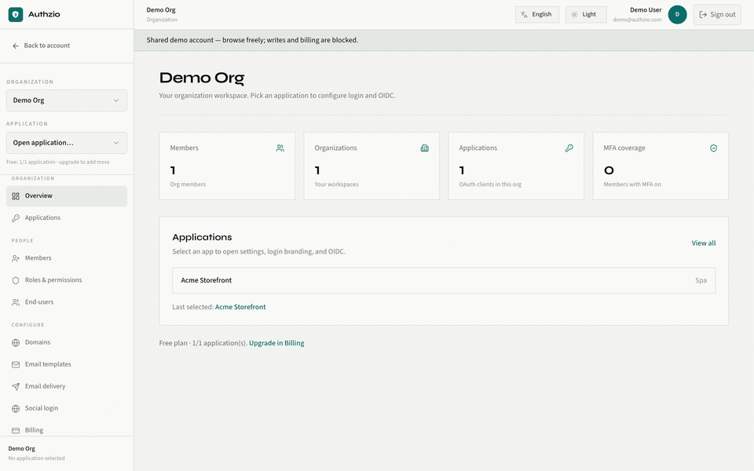
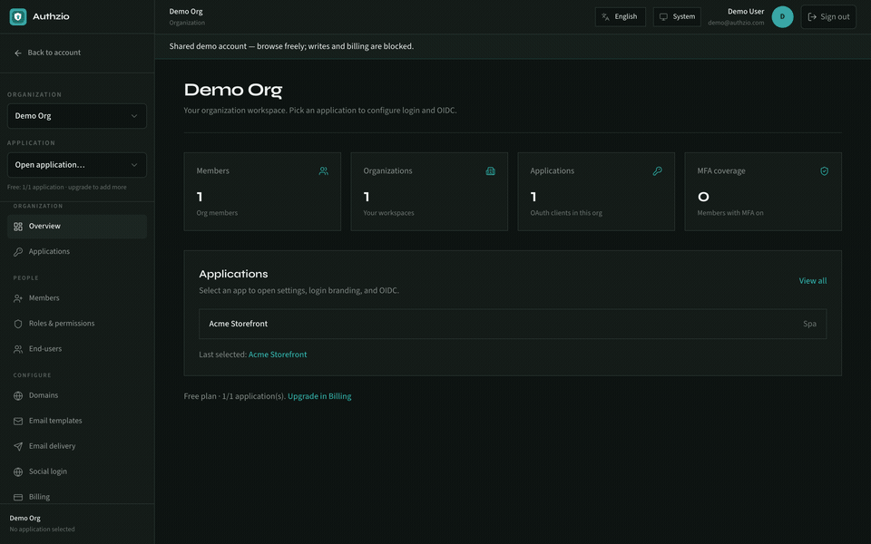

# Authzio

Open-source identity and access management. Self-host or use Authzio Cloud.

Laravel 13 · PHP 8.5 · React console · OAuth 2.1 / OIDC

**By [Azodik Consulting Private Limited](https://azodik.com)** · [github.com/azodik/authzio](https://github.com/azodik/authzio)

[](https://github.com/azodik/authzio/actions/workflows/ci.yml)
[](LICENSE)
[](https://github.com/sponsors/azodik)

<p align="center">
  
</p>

<details>
<summary>Dark mode walkthrough</summary>
<p align="center">
  
</p>
</details>

## Features

- Hosted login (password, social, email OTP, passkeys / WebAuthn)
- Authenticator MFA (TOTP) with recovery codes — console + hosted apps; optional per-app require MFA
- Enterprise OIDC SSO (Growth+ on Authzio Cloud)
- Organizations, roles, apps, domains, audit logs
- Team invitations — pending list with resend/revoke, invitation history, and an invitee inbox in the console
- OAuth 2.1 + OpenID Connect (PKCE, refresh, revoke, introspect, UserInfo, JWKS)
- Optional cloud billing (MAU) via Dodo Payments — upgrade/downgrade with webhooks

## Cloud plans (Authzio Cloud)

| Plan | Price | MAU | Highlights |
|------|-------|-----|------------|
| Free | $0 | 1,000 | 1 app · managed JWKS · Authzio subdomain |
| Starter | $5/mo | 5,000 | 5 apps · custom domains · branded / BYO email |
| Growth | $20/mo | 50,000 | Unlimited apps · OIDC enterprise SSO |
| Scale | $99/mo | 250,000 | Custom JWKS · onboarding / SLA options |
| Enterprise | Custom | Custom | SAML / OIDC federation · contracts |

Self-host remains free forever (`AUTHZIO_BILLING_ENABLED=false`).
## Requirements

- PHP 8.5+, Composer 2, Node 24+
- PostgreSQL 15+
- Redis (optional locally; recommended in production)

## Install

Pick one path. After install, open `/docs` for the same guides in the app.

### Laravel Herd (macOS)

```bash
git clone https://github.com/azodik/authzio.git
cd authzio
herd link authzio && herd secure authzio
composer install
cp .env.example .env && php artisan key:generate
# Create Postgres DB `authzio`, then:
php artisan migrate --seed
npm install && npm run dev
```

- Site: https://authzio.test · Docs: https://authzio.test/docs · Console: https://authzio.test/console

### Without Docker (PHP / Nginx or Apache)

```bash
git clone https://github.com/azodik/authzio.git
cd authzio
composer install
cp .env.example .env && php artisan key:generate
# Point the web server document root at `public/`
# Set DB_* in .env, create the database, then:
php artisan migrate --seed
npm install && npm run build
```

Use HTTPS in development when you can (cookies / OAuth).

Optional console Google / GitHub sign-in (self-host): set `CONSOLE_GOOGLE_CLIENT_ID` / `CONSOLE_GOOGLE_CLIENT_SECRET` and/or `CONSOLE_GITHUB_*` in `.env`. Register IdP callback URLs `{APP_URL}/console/auth/google/callback` and `{APP_URL}/console/auth/github/callback`. Leave them empty to hide the buttons. Existing email/password accounts link providers under **Settings → Linked accounts** (provider email must match).

### Docker Compose

```bash
export APP_KEY=base64:$(openssl rand -base64 32)
docker compose up --build
```

App: http://localhost:8080 · Console: http://localhost:8080/console

**Test a published GHCR image** (no local build):

```bash
export APP_KEY=base64:$(openssl rand -base64 32)
# optional: AUTHZIO_TAG=0.0.1
docker compose -f docker-compose.yml -f docker-compose.ghcr.yml pull
docker compose -f docker-compose.yml -f docker-compose.ghcr.yml up -d
```

Local Compose seeds demo data on boot (`AUTHZIO_SEED=true`). Postgres 18 mounts at `/var/lib/postgresql` (required by the official image). For Playwright mail catcher only: `docker compose -f docker-compose.e2e.yml up -d` (Mailpit on `:8025`).

Release builds **Linux** multi-arch images only (`linux/amd64` + `linux/arm64`):

| Host | Image |
|------|--------|
| Linux x86_64 / Windows Docker Desktop / Intel Mac | `linux/amd64` |
| Apple Silicon Mac / Linux arm64 | `linux/arm64` |

There is no native Windows container image (PHP/nginx stack runs as Linux containers on Docker Desktop/WSL2). Published images ship on version tags (see **Version** below).

### VPS (Ubuntu / Debian)

Does **not** install PostgreSQL or Redis — point `.env` at services you already run.

```bash
# First time (as root) — installs nginx/php/node, clones app, optional HTTPS
git clone https://github.com/azodik/authzio.git /tmp/authzio-src
cd /tmp/authzio-src
sudo ./deploy.sh --bootstrap \
  --domain=auth.example.com \
  --email=ops@example.com

# Point .env at Postgres (required). Queue/cache default to database — Redis optional.
sudo nano /var/www/authzio/.env

# Migrate (+ optional seed) once DB is reachable; renew TLS if DNS is ready
sudo /var/www/authzio/deploy.sh \
  --domain=auth.example.com \
  --email=ops@example.com \
  --seed
```

Later updates: `sudo /var/www/authzio/deploy.sh --domain=auth.example.com --email=ops@example.com`

Migrate is skipped automatically when the database is unreachable (so bootstrap can finish before you edit `.env`).

What you get:

- HTTPS via Let's Encrypt (`certbot`) for `auth.example.com` and `www.auth.example.com`
- `www` → apex redirect; HTTP → HTTPS
- Auto-renewal (`certbot.timer` or cron) + nginx reload hook
- Document root is `public/` only; `.env` is mode `600` and blocked in nginx
- nginx, PHP-FPM, Composer, Node, Supervisor; queue workers + `schedule:work`

Templates: [`deploy/`](deploy/). Skip TLS with `--no-ssl` if needed.

## Demo user (optional)

```bash
php artisan authzio:setup --with-demo
# or: php artisan db:seed --class=AuthzioSeeder
```

- Email: `demo@authzio.com`
- Password: `AuthzioDemo2026!` (read-only console)

Credentials and the walkthrough live on `/demo`. **Open console login** goes to `/console/login?demo=1`, which pre-fills the demo email. A normal `/console/login` visit does not.

## Organizations & invitations

- **Members** (org console): invite by email, **Resend** / **Revoke** on pending invites, and an **Invitation history** of accepted/revoked rows.
- **Invitee**: email link `/console/invites/{token}`, or after sign-in an **Invitations for you** list on Organizations / Overview (and on the empty home when they have no org yet). Accept requires signing in with the invited email.
- Sign-in / register / email verify keep a pending invite redirect so the accept page is restored after verification.

## Tests & quality

**CI (GitHub Actions):** Pint → typecheck → PHPUnit (unit + Feature only). No browser E2E or smoke in CI.

**Local E2E (Playwright + Mailpit):** run before release — covers console auth, invites, org pages, apps, roles, domains UI, onboarding.

```bash
# Unit + Feature (also what CI runs)
composer test
./vendor/bin/pint --test
npm run typecheck
php artisan authzio:launch-check

# Full browser E2E (local only)
docker compose -f docker-compose.e2e.yml up -d   # SMTP :1025, UI :8025
# Put real Dodo test API key + DODO_PRODUCT_* in .env first.
php artisan authzio:e2e-prepare  # copies .env.e2e.example → .env/.env.e2e (APP_ENV=e2e); preserves DODO_* keys
npm run test:e2e:install
npm run test:e2e
```

E2E owner fixture: `e2e-owner@authzio.test` / `E2eTestPass123!`. Restore your normal `.env` after E2E if you use Herd/Postgres day-to-day.

Playwright uses `APP_ENV=e2e` (not a separate feature flag). That environment unlocks `__e2e/*` helpers and relaxes rate limits; `local` / `production` / `testing` never do. Billing E2E hits **real Dodo test mode**; after hosted checkout, `POST /__e2e/dodo/sync` applies subscription/payment state locally (no webhook tunnel).

## Version & releases

Authzio uses **SemVer + build number**. Version describes the release; build uniquely identifies the artifact.

| Field | Example | Source of truth |
|-------|---------|-----------------|
| Version | `1.2.0` | [`VERSION`](VERSION) (keep `package.json` in sync for tooling; CI fails if they differ) |
| Build | `217` | CI (`Publish` workflow `run_number` + optional `AUTHZIO_BUILD_OFFSET`) — never resets for that workflow |
| Commit | `82af91c` | Git SHA baked at image build |
| Git tag / Release | `v1.2.0` / `Authzio 1.2.0` | Created when `VERSION` is bumped on `main` |
| Docker | `:1.2.0` | [GHCR](https://docs.github.com/en/packages/working-with-a-github-packages-registry/working-with-the-container-registry) `ghcr.io/<owner>/<repo>` |
| Console | `Authzio 1.2.0 (Build 217)` | Runtime meta (`/api/v1/meta`, sidebar footer) |

`composer.json` has **no** version field. Do not treat `package.json` as the deployed build identity.

| Event | What runs |
|-------|-----------|
| PR | Quality (Pint, typecheck, PHPUnit) |
| Merge to `main` | Quality → multi-arch push to GHCR (`:version`) — skipped when only CI/docs/changelog change |
| Bump `VERSION` (+ `package.json`) on `main` | Above + git tag `vX.Y.Z` + GitHub Release `Authzio X.Y.Z` (Docker archives) + changelog PR |
| Push tag `vX.Y.Z` | Same Publish workflow |

**Changelog:** each SemVer GitHub Release gets auto-generated notes (from PRs/commits). The Publish workflow also regenerates [`CHANGELOG.md`](CHANGELOG.md) with [git-cliff](https://git-cliff.org) and opens a PR to merge it into `main`. Prefer [Conventional Commits](https://www.conventionalcommits.org/) (`feat:`, `fix:`, …) so sections group cleanly.

```bash
docker pull ghcr.io/azodik/authzio:1.2.0
```

No GCP secrets. CI uses `GITHUB_TOKEN` with `packages: write`. After the first push, set the package visibility (public/private) under the repo’s **Packages** settings if needed. Optional repo variable `AUTHZIO_BUILD_OFFSET` starts the counter higher (e.g. `200` → first Publish run becomes build `201`).

Local / Herd builds show SemVer from `VERSION` and build `dev` unless you set `AUTHZIO_VERSION` / `AUTHZIO_BUILD` / `AUTHZIO_COMMIT`.

## OIDC (short)

Each **organization** is an issuer. **Applications** are OAuth clients under that issuer.

| Endpoint | Path |
|----------|------|
| Discovery | `/.well-known/openid-configuration` |
| JWKS | `/.well-known/jwks.json` |
| Authorize | `/oauth/authorize` |
| Token | `/api/oauth/token` |
| UserInfo | `/api/oauth/userinfo` |
| Revoke | `/api/oauth/revoke` |
| Introspect | `/api/oauth/introspect` |

Hosted authorize supports password, email OTP, social, SSO, and passkeys. Users with MFA enrolled are challenged before a code is issued. Only registered `redirect_uri` values are accepted.

### MFA (optional)

```env
AUTHZIO_MFA_ENABLED=true
AUTHZIO_MFA_ISSUER="${APP_NAME}"
# AUTHZIO_MFA_REQUIRED_FOR_ADMINS=false
```

Console: **Account → Settings** (Authenticator section). Apps can set **Require MFA** under Security.

## App setup helper

`npm run setup` / `npm run setup:force` run `php artisan authzio:setup` — that creates `.env`, migrates, and seeds billing plans. It does **not** configure Dodo Payments.

## Dodo Payments (Authzio Cloud billing)

Needed only if you want paid plan checkout. Self-host can skip this (`AUTHZIO_BILLING_ENABLED=false`).

1. Put your Dodo **test** API key in `.env`:

```env
DODO_PAYMENTS_API_KEY=your_test_api_key
DODO_PAYMENTS_ENVIRONMENT=test_mode
DODO_PAYMENTS_RETURN_URL="${APP_URL}/console/{organization_id}/billing"
```

2. Create or sync products (name, description, **price**), write `DODO_PRODUCT_*` into `.env`, and sync plans:

```bash
php artisan setup:dodo
```

Re-run `setup:dodo` after plan price changes — it PATCHes existing Dodo products. Use `--force` only when you want new product IDs.

3. For local webhooks, tunnel your app (e.g. ngrok) and register:

```bash
php artisan setup:dodo --webhook=https://<your-tunnel>/api/v1/webhooks/dodo
```

Webhook path is always `POST /api/v1/webhooks/dodo`.

## Billing (Authzio Cloud)

- Billed **per organization** (MAU shared across that org’s apps)
- Self-host: set `AUTHZIO_BILLING_ENABLED=false`
- **Free → paid:** hosted checkout (full plan price)
- **Paid → higher plan:** charges the **price difference** only; the new plan applies only after payment succeeds (webhook). Confirm dialog shows the difference amount.
- **Paid → lower paid plan:** scheduled for the **next billing date** (confirm in console; no immediate charge)
- **Paid → Free:** cancels renewal at **period end** (keep paid features until then)
- Selecting the plan you already have returns an error (no second charge)
- Run a queue worker so webhooks can finalize upgrades (`php artisan queue:work`)

## Docs & support

- In-app docs: `/docs`
- Legal: `/privacy`, `/terms`, `/cookies` on your Authzio host
- SEO routes (not static files): `/sitemap.xml`, `/robots.txt`, `/llms.txt`
- Issues: [github.com/azodik/authzio/issues](https://github.com/azodik/authzio/issues)
- Security-sensitive findings: prefer a private report to Azodik Consulting Private Limited via [azodik.com](https://azodik.com) rather than a public issue. See [`SECURITY.md`](SECURITY.md).

## Sponsor Authzio

**Self-hosting stays free forever.** Sponsorship is optional — it keeps that promise sustainable.

Authzio is the identity layer in front of your apps: login, MFA, OIDC, organizations, and audit. If you run it in production, you already depend on someone shipping security fixes, reviewing contributions, and maintaining releases. That work does not pay for itself through license fees.

**Why sponsor**

- **Keep self-host free** — MIT, no forced Cloud upsell, no paywall on core IAM
- **Fund security & maintenance** — dependency updates, CVE response, release engineering
- **Shape the roadmap** — sponsors help prioritize SSO, DX, and self-host ergonomics
- **Say thanks with signal** — stars help discovery; Sponsors keep the lights on

**Who this is for**

| You… | Consider |
|------|----------|
| Self-host Authzio for a product or company | A monthly or one-time Sponsor — you rely on the project staying healthy |
| Prefer zero ops | [Authzio Cloud](https://authzio.com) plans (optional managed hosting) |
| Just exploring | Star the repo and open issues — still valuable |

<p align="center">
  <a href="https://github.com/sponsors/azodik"></a>
</p>

→ **[github.com/sponsors/azodik](https://github.com/sponsors/azodik)**

## License

MIT · © Azodik Consulting Private Limited
